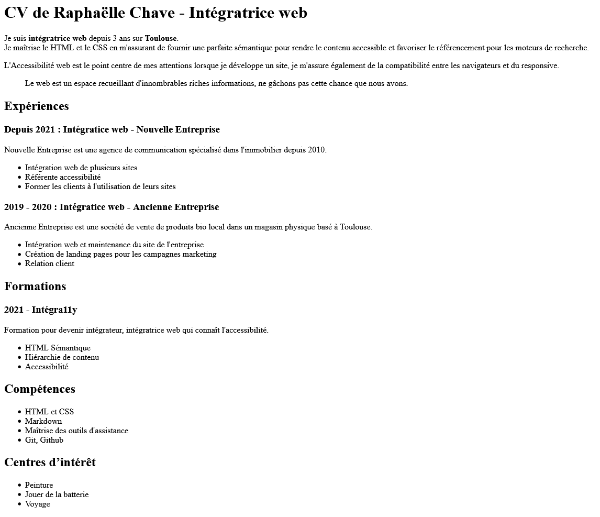

# Projet fil rouge - Challenge jour 1 : structure HTML

Ça y est, tu as fait ton premier vrai saut dans le HTML aujourd'hui ! Le mot « sémantique » devrait avoir plus de sens pour toi, désormais. 🎊

On a mis ça en pratique toute la journée à travers divers exercices et morceaux de code. Maintenant, on va utiliser tout ça dans un autre contexte : ton CV !

Bon, évidemment, la formation ne fait que commencer, tu as peu d'informations à mettre sur ton futur métier d'intégrateur ou intégratrice web. Ce n'est pas grave ! Deux solutions s'offrent à toi :

1. Tu mets les vraies informations de ton CV et tu pourras peaufiner ce CV au fil de la formation (ou à la fin) avec tout ce que tu auras appris de nouveau ;
1. Tu crées un faux CV au nom d'une personne fictive (le site [Lorraine Hipseaume](https://lorraine-hipseau.me/) devrait t'aider à trouver un super nom).

À titre d'information, ce CV sera mis en ligne à la fin de la partie 2 😉

## Binômes pour la revue de code

1. Ronald @AlexKi2D - Jules @Orry911
2. Aristide @nesoncode - Samantha @Samantha-a11y
3. Arthur @arthurgenestier - Jérémy @a-nemo
4. Claudio @cnmdc - Khadija @b-khadija
5. Lucas @LukasPrinny - Nasser @longjohnsilvah
6. Lorenzo @ElRefe - Hachmi @Ychim1
7. Rémy @Ox1zen - Souaad @Sencou
8. Romain @Romaintegrally - Johann @Scyanose

## Étapes

### Étape 1 : Mesurer ton temps de travail sur chaque exercice

Appuies-toi sur le fichier [temps.md](temps.md) pour commencer à mesurer ton temps de travail sur chaque exercice.

On le fera pour chaque challenge de ce projet fil rouge.

### Étape 2 : Créer une page web index.html qui servira pour y mettre ton CV

#### Exemple de rendu

#### Étapes pour y arriver

1. **Cloner ce dépôt Github** contenant le projet fil rouge en local (via VSCode)
1. **Créer une branche `init-cv-html`**
1. Dans cette branche, **créer une page web index.html à la racine de ce dépôt** et y écrire dedans la **structure de base d'un document HTML** (doctype, éléments `html`, `head`, `title`, `meta` charset, `body` qu'on a vu en cours).
1. Pour l'instant, nous n'aurons pas d'en-tête ni de pied de page mais **seulement le contenu principal**. Utiliser le bon élément.
1. Dans l'élément `body`, commencer par **construire la structure en titres de la page**. Attention aux niveaux choisis 😉 :
    1. Titre de la page à adapter : « CV de Prénom Nom - Intégrateur ou intégratrice web »
    1. Titres « Expériences », « Formations », « Compétences », « Centres d'intérêt »
    1. Pour les expériences et les formations, tu auras sûrement plusieurs entrées à indiquer. Veiller à utiliser des titres là aussi.
1. Remplir les **différentes sections** (💡 ceci est un indice) en utilisant les **bons éléments HTML sémantiques** qu'on a vu ce jour (`p`, `ul`, `ol`, `li`, etc.). N'hésites pas à mettre une introduction pour te présenter avant de lister tes expériences, formations, etc. avec, pourquoi pas, une citation qui te tient à cœur ?
1. **[Vérifier la validité du code HTML](https://validator.w3.org/nu/)**
1. **Commiter et pusher sur la branche `init-cv-html`** (note : il peut y avoir plusieurs commit et push au fil de l'eau, bien sûr)
1. Aller **dans Github pour lancer une « Pull request » (PR)** (une demande de fusion de la branche `init-cv-html` vers la branche principale `main` (ou `master`)).
1. **Donner le rôle "Triage" à ton binôme sur ton repo**
1. **Assigner la PR à ton binôme** pour qu'il ou elle relise ton code et te fasse des retours.
1. Une fois les retours reçus, **corriger puis valider la PR**. Vérifier que la branche principale contient bien ton fichier.

### Étape 3 : Relire le code de ton binôme

Dès que ton binôme a terminé le code de son côté, tu peux aller relire sa PR et lui faire des retours dessus via le système de commentaire des lignes de code vu la semaine dernière.
